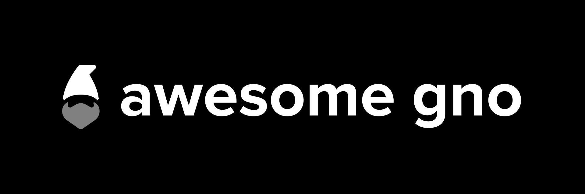

	

# Awesome Gno 

A curated list of awesome frameworks, libraries, software and resources related to the <a href='https://gno.land'>Gnoland</a> blockchain.

Gnoland is a robust blockchain that provides concurrency and scalability with smart contracts programmed in Gno, a Go interpreter.

> Do you gno?

## Contents

1. [Official](#official)
2. [Documentation](#documentation)
3. [Tools](#tools)
4. [Tutorials](#tutorials)
5. [Social](#social)
6. [Misc](#misc)
7. [Contributing](#contributing)

## Official

* [gno.land](https://gno.land/) - The official website of the project.
* [gno](https://github.com/gnolang/gno) - Main repo of the project, contains the core libraries and tools.
* [staging.gno.land](https://staging.gno.land/) - Staging environment, resetted perdiodically.
* [test1.gno.land](https://test1.gno.land/) - First official testnet environment (archive).
* [test2.gno.land](https://test2.gno.land/) - Second official testnet environment (archive).
* [test3.gno.land](https://test3.gno.land/) - Third official testnet environment.

## Documentation

* [README](https://github.com/gnolang/gno#readme)
* [Roadmap](https://github.com/gnolang/roadmap)
* [Plan](https://github.com/gnolang/gno/blob/master/PLAN.md)
* [Philosophy](https://github.com/gnolang/gno/blob/master/PHILOSOPHY.md)

## Tools

* [Gno to Discord](https://github.com/PoCInnovation/PoCLab) - Send notifications on Discord for new content on https://gno.land/r/boards.
* [Adena Wallet](https://adena.app/) - Friendly wallet that simplifies sending & receiving tokens, staking, NFT storage, and dapp connections.
* [Keplr Integration](https://github.com/gnolang/gno/pull/154) - WIP Integration with the Keplr browser extension.
* [Gnoscan](http://gnoscan.io/) - Gnoscan is a Gnoland blockchain explorer, making on-chain data legible and intuitive for everyone.
* [Gno Extension for VS Code](https://marketplace.visualstudio.com/items?itemName=harry-hov.gno) - Rich Gno/Gnolang support for Visual Studio Code.
* [Supernova](https://github.com/gnolang/supernova) - Stress testing tool for the Gno Tendermint2 blockchain.
* [Gno-mode for Emacs](https://gist.github.com/gfanton/6e233656dfeabd7a46f21f7507b6b311) - Major mode for editing GNO files in Emacs, based on go-mode. Work in progress.
* [Gno for Sublime Text](https://github.com/jdkato/gno-sublime-text) - Gno syntax highlighting for Sublime Text.

## Tutorials

* [Getting Started](https://github.com/gnolang/getting-started) - Get started with your first Gnolang Realm easily with this repo.
* [Gno By Example](https://gno-by-example.com) - Tutorials and code snippets for learning Gnolang.
* [Quickstart Guide](https://github.com/gnolang/gno/blob/master/examples/gno.land/r/demo/boards/README.md) - How to start interacting with the blockchain.
* [From Zero to Gnoland Hero](https://github.com/leohhhn/gno/blob/from_zero_to_gnoland_hero/examples/gno.land/whitelist/tutorial.md) - A complete 0 to 100 tutorial on your first dApp in Gnoland.
* [A Beginner’s Guide to the Gnoland Testnet](https://medium.com/@onbloc/a-beginners-guide-to-the-gnoland-testnet-6fdc693a48f4) - A visual guide to creating a wallet and receiving $GNOTs on the testnet.
* [Gnolang 101](https://github.com/onbloc/gnolang-101) - A course designed for aspiring smart-contract developers on Gnoland.
* [Gnolang Basics](https://github.com/moul/gno-basics) - Simple examples of Gnolang contracts.
* [Hello Gno!](https://github.com/xplrz/gnoland-workshop) - Step-by-step workshop to learn Gnolang and Gnoland features.
* [Start Writing a Realm](https://docs.onbloc.xyz/tutorials/start-writing-a-realm)
* [Gnoland Developer Portal](https://github.com/onbloc/gnoland-tutorials) - All-in-one place for Gnoland developers, providing introductions, tutorials with detailed examples, and developer resources.
* [Gno Smart Contract Demo](https://www.youtube.com/watch?v=-BlnEXCs0eI) - A short video tutorial on writing and deploying a simple Realm and Package.
* [Gno Chinese Station](https://www.gnoland.cn) - A website for Chinese Developers, providing tutorials, documents, and gno news.
* [Failing In Public](https://proggr.hashnode.dev/gnoland-initial-experience-gonzo-take-on-failing-in-public) - A gonzo journalist take on first gno/CosmosSDK experiences.
* [Setup & First Realm On Ubuntu](https://proggr.hashnode.dev/gnoland-localnet-walkthrough-first-realm-on-ubuntu) - Local installation & realm deployment on Ubuntu.
* [From Test3 To Main Branch](https://proggr.hashnode.dev/gnoland-from-main-branch-refactor-from-test3-toy-registrar-realm) - Capturing the minor adjustments needed as part of the refactor since test3.
* ["go -> gno" presentation](https://github.com/gnolang/workshops/tree/main/presentations/2023-06-26--go-to-gno--schollz) - "Things I wish I knew when I started out with Gno, when coming from a Go background" by Zack Scholl.
* [GnoChess](https://github.com/gnolang/gnochess) - A chess server implementation in Gno, complete with a frontend, faucet & tutorial to develop your own.

## SDKs & Clients

* [gnolang/blog](https://github.com/gnolang/blog) - `r/gnolang/blog` client, or how to create custom `gnokey` clients.

## Social

* [Discord](https://discord.gg/3YbdqVP8Tb)
* [Telegram](https://t.me/gnoland)
* [Twitter](https://twitter.com/_gnoland)
* [YouTube](https://www.youtube.com/@_gnoland)
* [Gnoland Boards](https://gno.land/r/boards)

## Misc

* [legacy Bounties (deprecated)](https://github.com/gnolang/bounties) - Legacy official bounty board.
* [Assets](https://github.com/gnolang/gno/tree/master/gnoland/assets) - Official logo and assets.
* [Peace](https://github.com/gnolang/gno/blob/master/gnoland/docs/peace.md) - Call for peace.
* [GitPOAP](https://www.gitpoap.io/gh/gnolang) - Contributors (Git) can mint POAPs.
* [Workshops & Talks](https://github.com/gnolang/workshops) - Slides and materials.

## Tips & Snippets

_Note: We'd like to try a section with small tips & snippets and less curation. Please open PRs with just a link to a gist, tweet, screenshot, or discussion._

* [Tendermint2 JSON-RPC Postman Collection](https://gist.github.com/zivkovicmilos/d7b98103f0611ac3b26202a29cee02c4)

## Contributing

Your contributions are always welcome! Please take a look at the [contribution guidelines](https://github.com/gnolang/awesome-gno/blob/master/CONTRIBUTING.md) first.

We will keep some pull requests open if we're not sure whether those libraries are awesome. You could [vote for them](https://github.com/gnolang/awesome-gno/pulls) by adding :+1: to them.
