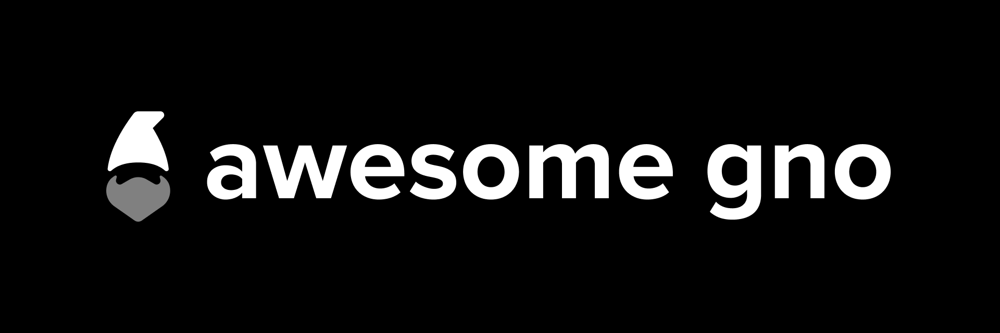

	
	  
	

> Do you gno?

This repository is a hub for apps, frameworks, libraries, and resources
related to Gno & gno.land. It serves two main purposes:

1. It’s a place for newcomers to explore what's happening on gno.land,
get inspiration and learn about how to become good contributors to gno.land.
2. It’s a space for everyone to publicly share their gno.land projects.

> _We update this repo periodically. We welcome any PRs that will
> add new content, update outdated content, or propose other ideas._

## Contents

1. [Official Links](#official-links)
2. [gno.land Networks](#gnoland-networks)
3. [Apps](#apps)
4. [Community Apps](#community-apps)
5. [Tools](#tools)
6. [Tutorials, Presentations, Resources](#tutorials-presentations-resources)
7. [SDKs & Clients](#sdks--clients)
8. [Frameworks](#frameworks)
9. [Socials](#socials)
10. [Misc](#misc)
11. [Tips & Snippets](#tips--snippets)
12. [Archive](#archive)

## Official Links

- [gno.land](https://gno.land/) - The official website of gno.land.
- [gno monorepo](https://github.com/gnolang/gno) - The official core repo of the project, containing the core libraries, tools, and example Gno code.
- [docs.gno.land](https://docs.gno.land) - The official docs of gno.land.
- [r/docs](https://staging.gno.land/r/docs/home) - The on-chain documentation realm, with runnable examples rendered directly in gno.land.
- [gno.land events calendar](https://gno.link/calendar) - The official gno.land Google calendar.
- [Plan](https://github.com/gnolang/gno/blob/master/PLAN.md) - The foundational plan for gno.land.
- [Philosophy](https://github.com/gnolang/gno/blob/master/PHILOSOPHY.md) - The fundamental philosophies of gno.land.

## gno.land Networks

_The currently active gno.land networks._

- [The Portal Loop](https://docs.gno.land/resources/gnoland-networks) - A rolling testnet, serving as the gno.land homepage.
- [topaz.testnets.gno.land](https://topaz.testnets.gno.land/) - The latest stable testnet environment.
- [test13.testnets.gno.land](https://test13.testnets.gno.land/) - The previous stable testnet environment.

## Apps

_Apps developed by the gno.land team._

- [Gno Playground](https://play.gno.land/) - An online Gno editor that allows for quick testing, deploying, and sharing of Gno code, modeled after the Go Playground.
- [Gno Studio Connect](https://gno.studio/connect) - A tool that makes interaction with Gno applications simple.
- [GnoChess](https://github.com/gnolang/gnochess) - A chess server implementation in Gno, complete with a frontend, faucet & tutorial to develop your own.
- [meme.land](https://github.com/gnolang/memeland) - An image sharing application built using Gno, React and Vue.
- [Gno Faucet Hub](https://faucet.gno.land) - A central place for all gno.land faucets.
- [Is gno.land down?](https://status.gnoteam.com) - A dashboard showing the status of gno.land services & networks.
- [OpenOcean](https://github.com/Molaryy/openocean) - OpenSea Clone in Gno.

## Community Apps

_Apps developed by the gno.land community._

- [Gnoswap](https://github.com/gnoswap-labs/gnoswap) - The first DEX built on gno.land (currently in beta).
- [Adena Wallet](https://adena.app/) - Friendly wallet that simplifies sending & receiving tokens, staking, NFT storage, and dapp connections.
- [Gnolove](https://gnolove.world) - Community leaderboard and contributions analytics for builders of the Gnoland ecosystem.
- [Zenao](https://zenao.io) - Organize events in seconds then build your resilient community & social organizations.
- [Gnomputer](https://github.com/moul/gnomputer) - A windowed web workstation for browsing realms, source, and live chain activity.
- [dSocial](https://github.com/gnoverse/dsocial) - Experimental social apps, tools, and dApps.

## Tools

_Tools useful for developing in Gno._

- [gnodev](https://github.com/gnolang/gno/tree/master/contribs/gnodev) - Your Gno development companion, used for local Gno development.
- [Gno Debugger](https://gno.land/r/gnoland/blog:p/gno-debugger) - A debugger that comes packaged with the GnoVM.
- [GnoScan](http://gnoscan.io/) - A gno.land block explorer, making on-chain data legible and intuitive for everyone.
- [tx-indexer](https://github.com/gnolang/tx-indexer) - A TM2 (Tendermint2) chain indexer with GraphQL support.
- [Supernova](https://github.com/gnolang/supernova) - A stress testing tool for the Gno Tendermint2 blockchain.
- [Gno Extension for VS Code](https://marketplace.visualstudio.com/items?itemName=harry-hov.gno) - Experimental language support for Gno in VS Code.
- [Gno-mode for Emacs](https://gist.github.com/gfanton/6e233656dfeabd7a46f21f7507b6b311) - Major mode for editing Gno files in Emacs, based on go-mode. Work in progress.
- [Gno for Sublime Text](https://github.com/jdkato/gno-sublime-text) - Gno syntax highlighting for Sublime Text.
- [:GnoFileTest command for vim](https://gist.github.com/grepsuzette/66f5cfaccc1a919c67f52bd7b31a3b09) - The `:GnoFileTest` snippet for vim.
- [gno.nvim](https://github.com/x1unix/gno.nvim) - Gno language support for NeoVim.
- [gnopls](https://github.com/gnoverse/gnopls) - A language server providing editor features like autocompletion, hover, and go-to-definition.
- [gno-mcp](https://github.com/gnoverse/gno-mcp) - An MCP server and agent skill connecting realms to AI coding assistants like Claude, Cursor, and Gemini CLI.
- [gnobro](https://github.com/gnolang/gno/tree/master/contribs/gnobro) - A terminal UI for browsing and exploring Gno realms, with real-time gnodev integration via WebSocket.
- [gnovanity](https://github.com/gnoverse/gnovanity) - A command-line tool for generating vanity wallet addresses.
- [gnockpit](https://github.com/gnoverse/gnockpit) - A real-time web dashboard for monitoring validator node health.

## Tutorials, Presentations, Resources

_Resources to help you understand how to get around gno.land and use Gno._

- [Getting Started](https://github.com/gnolang/getting-started) - A repo to help you get started with building realms in Gno.
- [A gentle introduction to gno.land](https://www.youtube.com/watch?v=hTGeG0z09NU&t=135s) - An intro presentation into gno.land (2024).
- [gno-contracts](https://github.com/moul/gno-contracts) - A collection of 50+ versioned, self-contained gno.land packages and realms by moul, tested against gno master.

## SDKs & Clients

_Connecting web2 to the gno.land blockchain._

- [gnoclient](https://github.com/gnolang/gno/tree/master/gno.land/pkg/gnoclient) - A Gno-Go package, allowing you to connect to gno.land chains via Go programs at will.
- [gnolang/blog](https://github.com/gnolang/blog/tree/main/cmd/gnoblog-cli) - `r/gnolang/blog` client, or how to create custom `gnokey` clients, using the [gnoclient](https://github.com/gnolang/gno/tree/master/gno.land/pkg/gnoclient) package.
- [tm2-js-client](https://github.com/gnolang/tm2-js-client) - A TM2 JavaScript client library.
- [gno-js-client](https://github.com/gnolang/gno-js-client) - A Gno JavaScript client library, built upon `tm2-js` with additional Gno-specific functionality.
- [gnonative](https://github.com/gnolang/gnonative) - A framework for building and porting gno.land dApps in your native language, with React Native and Expo support.

## Frameworks

_Collections of gno packages providing generic functionality which developers can extend with custom code to create applications._

- [daokit](https://github.com/samouraiworld/gnodaokit) - Create DAOs that can mirror real-world organizations.
- [gnit](https://github.com/gnoverse/gnit) - A composable Git protocol package that lets any realm act as a Git repository.

## Socials

_gno.land's official socials._

- [Discord](https://discord.com/invite/YFtMjWwUN7)
- [Telegram](https://t.me/gnoland)
- [X/Twitter](https://x.com/_gnoland)
- [YouTube](https://www.youtube.com/@_gnoland)

## Misc

_Miscellaneous._

- [Branding & Assets](https://github.com/gnolang/branding) - Official logo and assets.
- [Peace](https://gno.land/r/gnoland/blog:p/peace) - A call for peace.
- [GitPOAP](https://www.gitpoap.io/gh/gnolang) - Contributors (Git) can mint POAPs.
- [Workshops & Talks](https://github.com/gnolang/workshops) - Slides, videos, and materials to gno.land workshops.
- [legacy Bounties (deprecated)](https://github.com/gnolang/bounties) - Legacy official bounty board.

## Tips & Snippets

_Note: We'd like to try a section with small tips & snippets and less curation. Please open PRs with just a link to a gist, tweet, screenshot, or discussion._

- [Tendermint2 JSON-RPC Postman Collection](https://gist.github.com/zivkovicmilos/d7b98103f0611ac3b26202a29cee02c4)
- [GoLand IDE Intellisense Workaround](https://x.com/leohhhn/status/1836740567541367157) - Developing in the Gno monorepo can provide Gno Intellisense using the builtin Go language support.

## Contributing

Your contributions are always welcome! Please take a look at the 
[contribution guidelines](https://github.com/gnoverse/awesome-gno/blob/master/CONTRIBUTING.md) first.

We will keep some pull requests open if we're not sure whether those libraries 
are awesome. You could [vote for them](https://github.com/gnoverse/awesome-gno/pulls) by adding :+1: to them.

## Archive

_Older, outdated, or archived items._

- [Keplr Integration](https://github.com/gnolang/gno/pull/154) - WIP Integration with the Keplr browser extension.
- [Gno to Discord](https://github.com/PoCInnovation/PoCLab) - Send notifications on Discord for new content on the `r/demo/boards` realm.
- [test5.gno.land](https://test5.gno.land/) - Fifth official testnet environment (archive).
- [test3.gno.land](https://test3.gno.land/) - Third official testnet environment (archive).
- [test2.gno.land](https://test2.gno.land/) - Second official testnet environment (archive).
- [test1.gno.land](https://test1.gno.land/) - First official testnet environment (archive).
- [tx-exports](https://github.com/gnolang/tx-exports) - Archived transaction data from past and present gno.land networks (gnoland1, staging, topaz, and the test1-test13 testnets).
- [Hello Gno!](https://github.com/xplrz/gnoland-workshop) - A step-by-step workshop on Gno and gno.land's main features.
- ["go -> gno" presentation](https://github.com/gnolang/workshops/tree/main/presentations/2023-06-26--go-to-gno--schollz) - "Things I wish I knew when I started out with Gno, when coming from a Go background" by Zack Scholl (2023).
- [Failing In Public](https://proggr.hashnode.dev/gnoland-initial-experience-gonzo-take-on-failing-in-public) - A gonzo journalist take on first gno/CosmosSDK experiences.
- [From Zero to gno.land Hero](https://github.com/leohhhn/gno-fzgh/blob/main/README.md) - A complete 0 to 1 tutorial on building your first dApp in gno.land (2024).
- [A Beginner’s Guide to the gno.land Testnet](https://medium.com/@onbloc/a-beginners-guide-to-the-gnoland-testnet-6fdc693a48f4) - A visual guide to creating a wallet and receiving $GNOTs on the testnet (2022).
